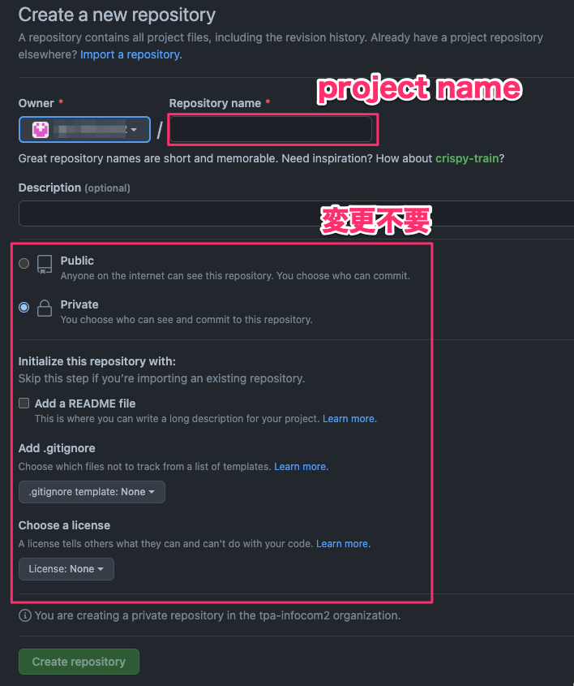
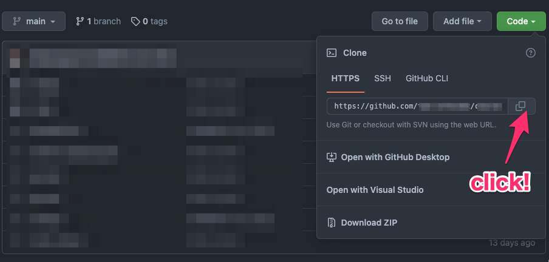

# プロジェクトの初期化と開発環境の構築

ここではFlutterのSDKを使ってプロジェクトを初期化します。  
さらに、Gitのリポジトリを初期化し、GitHub上に作成したリポジトリと紐付けるなど、開発環境の構築を行います。  


## Flutterプロジェクトの初期化
[flutter create](https://docs.flutter.dev/reference/flutter-cli)コマンドを使ってプロジェクトを初期化します。  
※`flutter create`、もしくはvscodeのプラグインに含まれる機能を使ってプロジェクトを初期化してください。  

```
flutter create summarist
```

プロジェクトの初期化が終わったら、そのディレクトリに`cd`しておきましょう。  

```
cd summarist
```

実際に初期化が終わったらシミュレータで実行し、問題無く起動することを確認してください。  

## 開発環境の構築
先ほど作成したSummaristのディレクトリに`cd`したら開発環境を構築します。  

### GitHubにリポジトリを作成
研修で使っているGitHubのOrganizationである******にリポジトリを作成します。  

リポジトリに名前は、先ほど作成したFlutterプロジェクトの名前と一致させてください。  
それ以外のチェックボックスはすべてデフォルトのままで変更しないでください。  



### Gitリポジトリの初期化
ローカルのターミナルに戻り、FlutterプロジェクトのあるリポジトリでGitを初期化します。  

```
git init
git add -A
git commit -m "Initial commit"
```

### GitHubリポジトリとローカルリポジトリの紐付け
ローカルのGitリポジトリに、先ほど作成したGitHubリポジトリをremoteとして登録します。  

まずは、GitHub上のリポジトリのURLをコピーします。  



そして、ローカルリポジトリがあるディレクトリで以下のコマンドを実行します。  

```
git remote add origin <コピーしたURL>
```

以下のコマンドで登録したremoteが表示されれば成功です。  

```
git remote -v
```

あとは、先ほど作成したoriginにPUSHします。  

その前に、デフォルトのブランチ名が`master`になっている場合は、以下のコマンドを実行して`main`に変更してください。  

```
git branch -M main
```

変更後PUSHします。  

```
git push origin main
```

