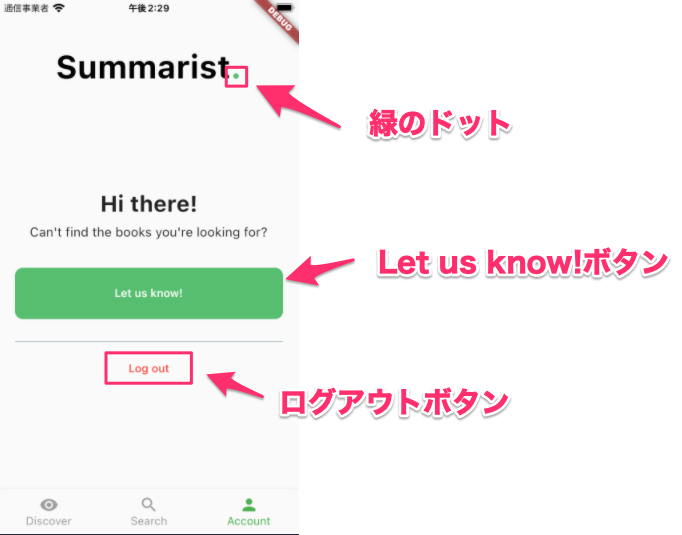

# HomePageの雛形とAccountWidget
ここではHomePage、及びその中に表示するページであるAccountWidgetを作成します。  

## HomePageの仕様

### HomePageの全体像
HomePageの画面は次のようになっています。  
以下のスクショはHomePageの中でAccountを表示させたものです。  


## BottomNavigationBar

HomePageの画面下部にはBottomNavigationBarが配置されています。  
BottomNavigationBarで表示するWidgetを切り替えることができます。  


今回、BottomNavigationBarには

- Discover
- Search
- Account

の3つが登録されています。  
ここでは、このうちのAccountを作成します。  

### AccountWidget
Accountの注意点を記載します。  

- 画面上部の`Summarist.`のドットの色は緑色です。
- `Let us know!`ボタン、および`ログアウト`ボタンは現時点ではボタンを配置するだけで構いません。(機能は後で実装)



## 開発の準備
Gitを使ってコードを管理しながら開発を進めていきます。  
まずは、今回のHomePage、AccountWidget追加用のブランチを作成します。  


以下のコマンドでブランチを作成できます。  

```
git checkout -b homepage
```

※ブランチの名前は任意です。ここでは、`homepage`というブランチを作成する前提で記載していきますが、自分で考えた名前を付けてもOKです。

ここで作成したブランチに対してcommitしていきましょう。  

ブランチができたら、今回開発を進めていくディレクトリも作成しておきましょう。  

```
mkdir -p lib/features/home/account
```

## タスク1: BottomNavigationBarの作成

（必要に応じて[ヒント](../hints/bottom_navigation_bar/bottom_navigation_bar_hint.md)を参照してください）

1. `lib/features/home/home_page.dart`を作成
2. `Scaffold`と`BottomNavigationBar`で以下のような画面を作成


3. `main.dart`を編集し、`home_page.dart`が表示されるようにする。
4. アプリのアイコンを設定。


Summaristのアイコン

- デバイスの中央部（BottomNavigationBarの上）にページを表示するには、Scaffoldの`body`プロパティを使用します。
  - AccountとDiscoverの内部ではScaffoldは不要です。

- HomePageのAccount以外（DiscoverとSearch）が選択された際には、`Not implemented yet`を表示する`Container`ウィジェットを使ってください。

- アプリのアイコンを生成するには[AppIcon](https://appicon.co/)を使ってください。
  - アイコンの画像データは[こちら](./summarist_1024.png)にあります。

## タスク2: Accountの作成
1. `lib/features/home/account/account_widget.dart`を作成
1. 以下を参考にAccountを再現(BottomNavigationBarのAccountをタップしたら、この画面に切り替わるようにする)


:bulb: すでにHomePage内にScaffoldがあるため、Account内部にScaffoldは不要です :x:  
  通常、Scaffoldの配下にScaffoldをもう1つ追加するのは悪いアイディアです。 :japanese_goblin: 


## 完成したら
commitしてPUSHして、プルリクエストを作成しよう！

```
git add <コミットするファイル>
git commit -m "<変更内容が分かるメッセージ>"
git push origin <ブランチ名>
```

その後、GitHubの当該リポジトリで`main`へのプルリクエストを作成し、Slackでメンターにレビューを依頼してください。  
メンターに`Approve`されたら、`main`にマージして次の手順に進みましょう！ :tada:
