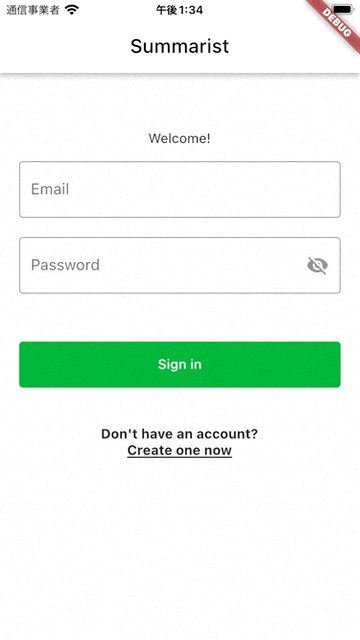
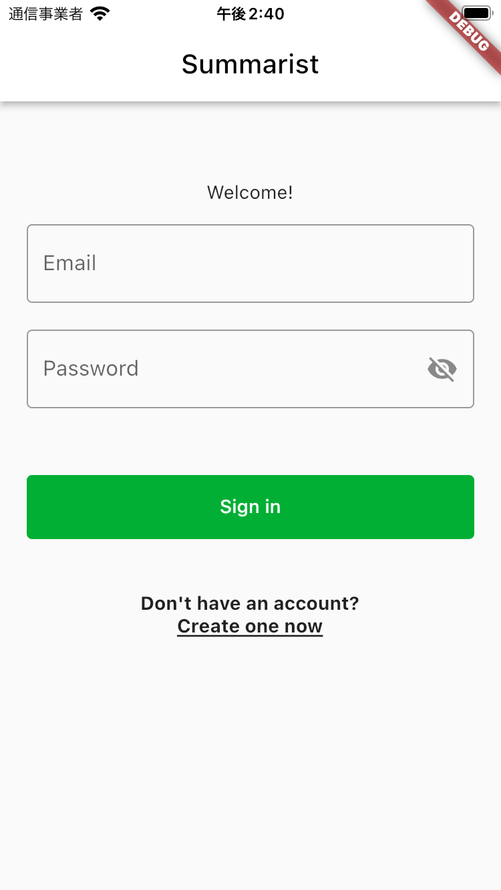
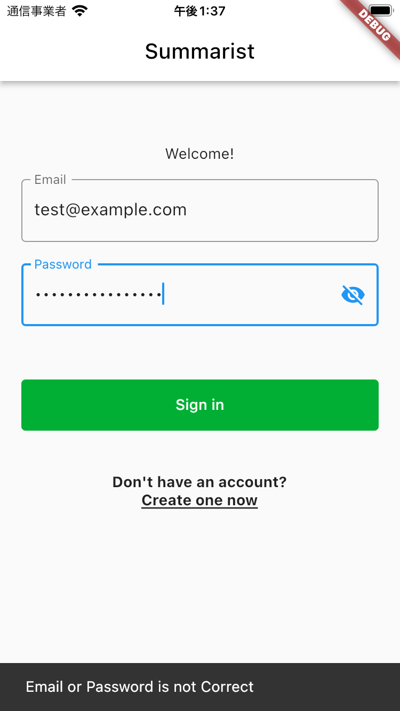
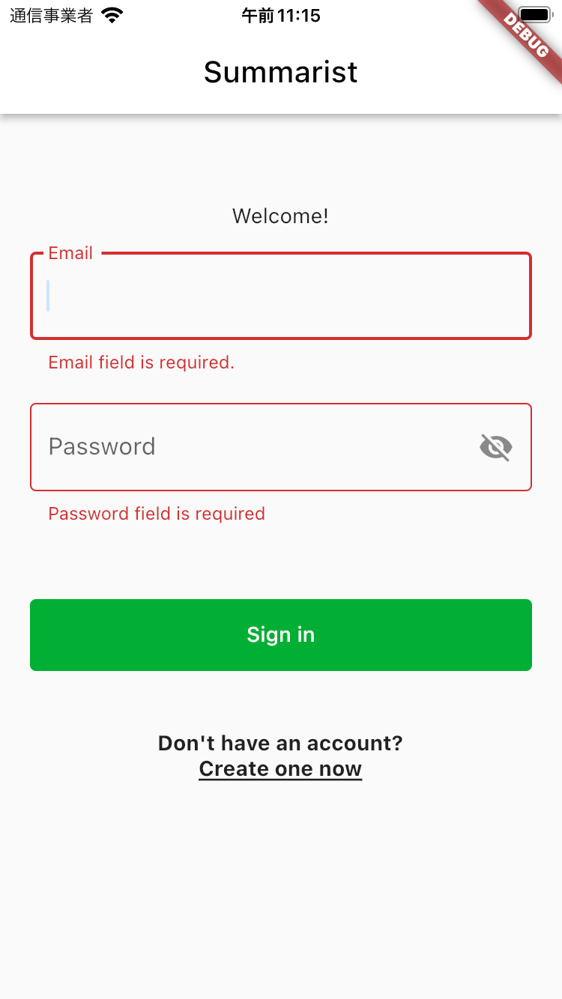
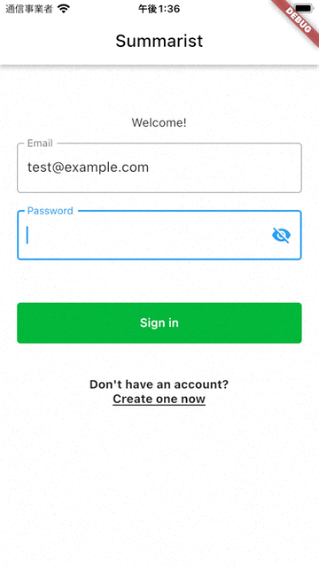
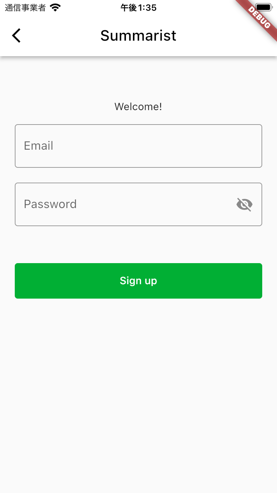
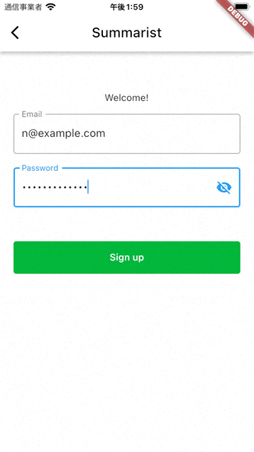

# SignInPageとSignOutPage
ここではSignInPageとSignOutPageを実装します。  

## SignInPageとSignUpPage
SignInPageとSignUpPageは次のように画面遷移します。  
また、入力内容のバリデーションも提供します。  




## SignInPageの仕様
SignInPageはSummaristのアカウントを持っているユーザに向けてサインイン（ログイン）機能を提供します。  



EmailおよびPasswordを入力し、`Sign In`ボタンをタップすることでログインできます。このとき、入力内容をサーバに送信します。  
ログインに成功した場合はサーバから受け取った認証トークンをSharedPreferencesに保存し、HomePageに遷移します。  

なお、サインインに失敗した場合は以下のように表示します。  



入力内容に問題があった場合は、以下のように表示します。  



なお、バリデーションの内容は次の通りです。

- `Email`は`Email`の形式になっている文字列
- `Password`は最低10文字、その中に大文字と小文字、数字が最低1つずつ含まれている

バリデーションに失敗した場合は、その内容をユーザに伝える任意のメッセーを表示します。  

また、入力したパスワードは :eye: のボタンを押して平文での表示に切り替えられます。  





アカウントがないユーザは`Create one now`ボタンをタップして、SignUpPageに遷移できます。  


## SignUpPageの仕様
入力フォーム（EmailおよびPassword）の仕様はSignInPageと同様です。  



`Sign up`ボタンをタップした際に入力内容をサーバに送信します。  
登録に成功した場合は認証トークンが返却されますので、SharedPreferencesに保存します。その後、HomePageに遷移します。  

なお、登録に失敗した場合は、以下のように表示します。  
※表示内容は工夫して構いません。  



AppBarの`<`ボタンをタップすることで、前の画面に戻れるようにします。  

## 開発の準備
前回同様、適切なブランチを作成して開発を進めます。  

```
git checkout -b <ブランチ名>
```

ブランチができたら、今回開発を進めていくディレクトリも作成しておきましょう。  

```
mkdir lib/features/sign_in
mkdir lib/features/sign_up
```

## タスク1: SignInPageの開発
※下記手順は参考。自分が進めやすい順番で自由に進めて構いません。

（必要に応じてUIに関する[ヒント](../hints/form/form.md)を参照してください）
（必要に応じてネットワークに関する[ヒント](../hints/sign_in/sign_in.md)を参照してください）

1. `lib/features/sign_in/sign_in_page.dart`を作成
1. `sign_in_page.dart`に見た目などを再現
1. `lib/features/sign_in/sign_in_repository.dart`、および同じ階層にそれぞれ`sign_in_cubit.dart`、`sign_in_state.dart`を作成
1. ビジネスロジックの作成

なお、サインインのサーバのエンドポイントは次の通りです。  
※あらかじめ提供しているサーバを起動してください。  
※ポート番号などは設定に応じて変更してください。 

```
> ADDRESS: 
http://localhost:8080/auth/sign-in

> METHOD:
POST

> HEADERS:
accept: application/json
Content-Type: application/json

> BODY:
{
  "email": String,
  "password": String
}

> RESPONSE:
{
  "token": "String"
}
```


## タスク2: SignUpPageの開発
※下記手順は参考。自分が進めやすい順番で自由に進めて構いません。  

1. `lib/features/sign_up/sign_up_page.dart`を作成
1. `sign_up_page.dart`に見た目などを再現
1. `lib/features/sign_up/sign_up_repository.dart`、および同じ階層にそれぞれ`sign_up_cubit.dart`、`sign_up_state.dart`を作成
1. ビジネスロジックの作成

なお、サインインのサーバのエンドポイントは次の通りです。  
※あらかじめ提供しているサーバを起動してください。  
※ポート番号などは設定に応じて変更してください。 

```
> ADDRESS: 
http://localhost:8080/auth/register

> METHOD:
POST

> HEADERS:
accept: application/json
Content-Type: application/json

> BODY:
{
  "email": String,
  "password": String
}

> RESPONSE:
{
  "token": String,
  "account":
	{
	  "id": String,
	  "email": String,
	  "role": "user"
	}
}
```

## タスク3: ログアウトの実装
HomePageのAccountにある`log out`ボタンを実装しよう。  
SharedPreferencesに保存してある認証トークンを削除し、SignInPageに遷移させます。  


## 完成したら
commitしてpushして、プルリクエストを作成しよう！

```
git add <コミットするファイル>
git commit -m "<変更内容が分かるメッセージ>"
git push origin <ブランチ名>
```

その後、GitHubの当該リポジトリで`main`へのプルリクエストを作成し、Slackでメンターにレビューを依頼してください。  
メンターに`Approve`されたら、`main`にマージして次の手順に進みましょう！ :tada:
