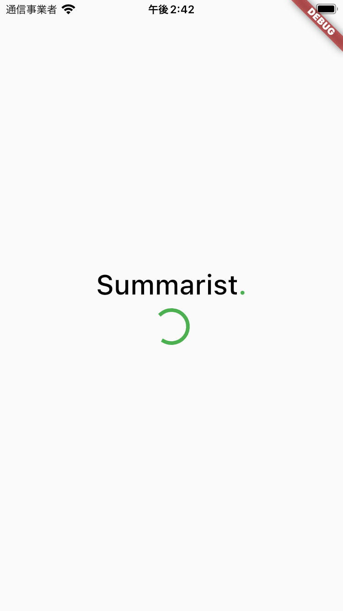
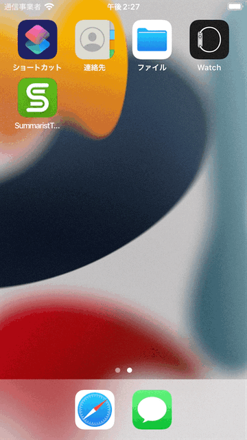

# SplashPage
ここでは、以下のようなSplashPageを作成します。  



## SplashPageの仕様
SplashPageはアプリの起動時に一定時間（2秒程度）表示します。  



なお、SplashPageは一定時間後に画面遷移を行います。  
ただし、SharedPreferencesに認証トークンが保存されているか否かで遷移先が変わります。  

- 認証トークンが存在する: HomePage
- 認証トークンが存在しない: SignInPage

※認証トークンはSignInPageかSignUpPageがSharedPreferences内に保存します。

（必要に応じて[ヒント](../hints/shared_preferences/shared_preferences.md)を参照してください）

## 開発の準備
前回同様、適切なブランチを作成して開発を進めます。  

```
git checkout -b <ブランチ名>
```

ブランチができたら、今回開発を進めていくディレクトリも作成しておきましょう。  

```
mkdir lib/features/splash
```

## タスク1: SplashPageの開発
※下記手順は参考。自分が進めやすい順番で自由に進めて構いません。  

1. `lib/features/splash/splash_page.dart`を作成
1. `splash_page.dart`にSplashPageの振る舞いを実装

## 完成したら
commitしてpushして、プルリクエストを作成しよう！

```
git add <コミットするファイル>
git commit -m "<変更内容が分かるメッセージ>"
git push origin <ブランチ名>
```

その後、GitHubの当該リポジトリで`main`へのプルリクエストを作成し、Slackでメンターにレビューを依頼してください。  
メンターに`Approve`されたら、`main`にマージして次の手順に進みましょう！ :tada:
