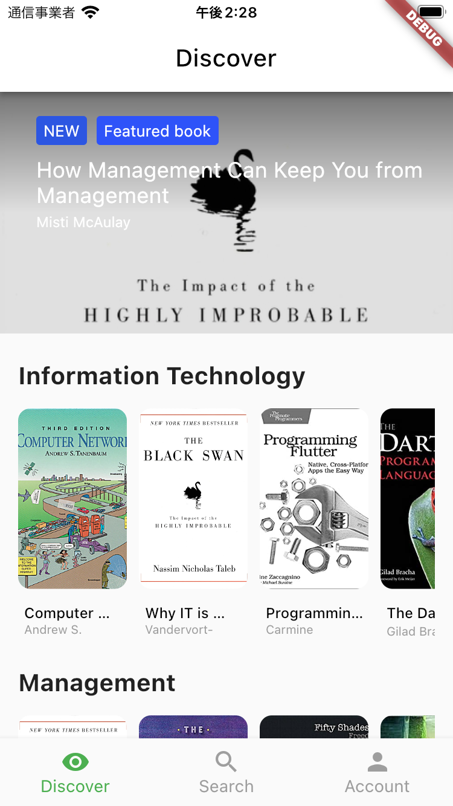
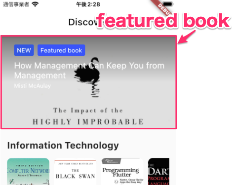

# DiscoverWidget(HomePage)
ここでは、HomePage内で表示するDiscoverWidgetを開発します。  


## Discoverの仕様
Discoverにアクセスすると、サーバから本の情報を取得します。  
サーバが返す本の情報には、その本のカテゴリ情報が含まれています。



なお、画面上部には`featured book`を表示します。  



`featured book`は受信した情報のなかからランダムに1つ選んで表示します。  


## 開発の準備
前回同様、適切なブランチを作成して開発を進めます。  

```
git checkout -b <ブランチ名>
```

ブランチができたら、今回開発を進めていくディレクトリも作成しておきましょう。  

```
mkdir lib/features/home/discover
```

## タスク1: Discoverの開発
※下記手順は参考。自分が進めやすい順番で自由に進めて構いません。

（必要に応じて[ヒント](../hints/list_view/list_view.md)を参照してください）

1. `lib/features/home/discover/discover_widget.dart`を作成 
1. `discover_widget.dart`に見た目などを再現
1. `lib/features/home/discover/discover_repository.dart`、および同じ階層にそれぞれ`discover_cubit.dart`、`discover_state.dart`を作成
1. ビジネスロジックの作成

なお、本の情報を取得するサーバのエンドポイントは次の通りです。  
※あらかじめ提供しているサーバを起動してください。  
※ポート番号などは設定に応じて変更してください。 

```
> ADDRESS: 
http://localhost:8080/books

> METHOD:
GET

> HEADERS:
accept: application/json

> RESPONSE:
[
    {
        "title": String
        "author": String
        "isbn": String
        "id": String
        "published_at": String
        "publisher": String
        "cover_url": String
        "overview": String
        "key_insights": [String]
        "category_id": String
        "category": {
            "id": String
            "name": String
        }
        "starred": bool
    }
]
```

※今回のRESPONSEの構造は複雑です。`curl`コマンドを使って実際のデータを確認してください。


:warning: Warning!!
- `discover_widget.dart`の中にScaffoldは入れないこと！（:x: Scaffold in Scaffoldは通常、悪いアイディアです。 :japanese_goblin: )

## 完成したら
commitしてpushして、プルリクエストを作成しよう！

```
git add <コミットするファイル>
git commit -m "<変更内容が分かるメッセージ>"
git push origin <ブランチ名>
```

その後、GitHubの当該リポジトリで`main`へのプルリクエストを作成し、Slackでメンターにレビューを依頼してください。  
メンターに`Approve`されたら、`main`にマージして次の手順に進みましょう！ :tada:
