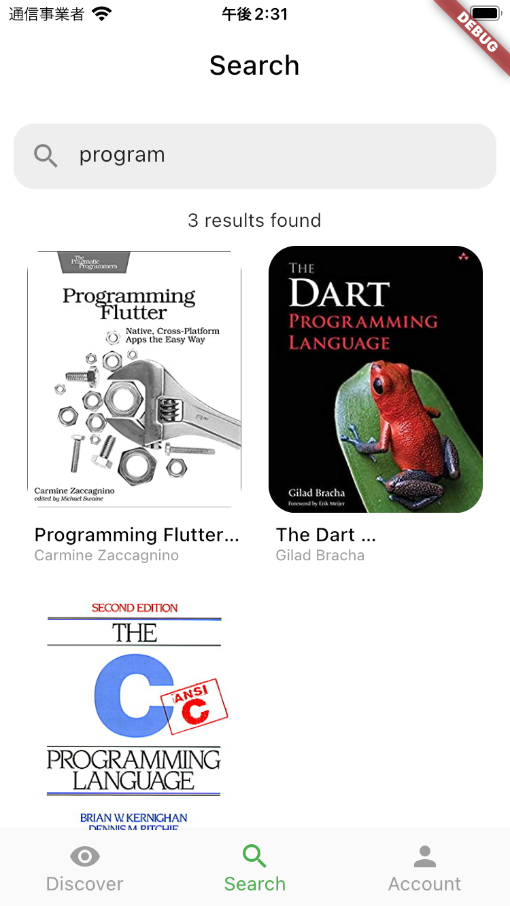
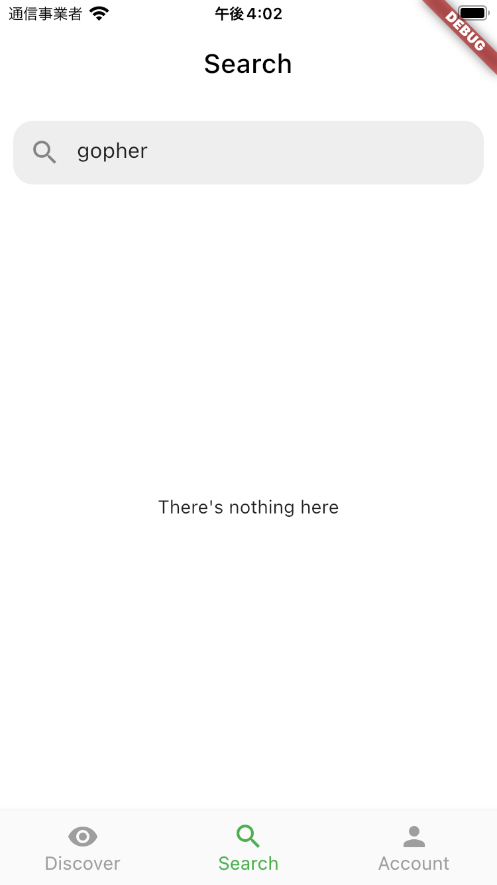

# SearchWidget(HomePage)
ここでは、HomePage内で表示するSearchWidgetを開発します。  
Searchでは、本を検索できます。  


# Searchの仕様
HomePageのBottomNavigationBarで「Search」が選択されると、Searchにアクセスできます。  


検索用のTextFieldに文字を入力して確定すると、入力された文字列をサーバに送信して検索結果を受信します。  



また、検索結果が0件だった場合はその旨ユーザに知らせます。  




## 開発の準備
前回同様、適切なブランチを作成して開発を進めます。  

```
git checkout -b <ブランチ名>
```

ブランチができたら、今回開発を進めていくディレクトリも作成しておきましょう。  

```
mkdir lib/features/home/search
```

## タスク1: Searchの開発
※下記手順は参考。自分が進めやすい順番で自由に進めて構いません。  

1. `lib/features/home/search/search_widget.dart`を作成
1. `search_widget.dart`に見た目などを再現
1. `lib/features/home/search/search_repository.dart`、および同じ階層にそれぞれ`search_cubit.dart`、`search_state.dart`を作成
1. ビジネスロジックの作成

なお、本の情報を取得するサーバのエンドポイントは次の通りです。  
※あらかじめ提供しているサーバを起動してください。  
※ポート番号などは設定に応じて変更してください。 

```
> ADDRESS: 
http://localhost:8080/books/search?q=<検索ワード>

> METHOD:
GET

> RESPONSE:
[
    {
        "title": String
        "author": String
        "isbn": String
        "id": String
        "published_at": String
        "publisher": String
        "cover_url": String
        "overview": String
        "key_insights": [String]
        "category_id": String
        "category": {
            "id": String
            "name": String
        }
        "starred": bool
    }
]
```

※今回のRESPONSEの構造は複雑です。`curl`コマンドを使って実際のデータを確認してください。

検索対象の文字列はクエリストリングで指定することに注意してください。  
例えば、`prog`で検索する場合は次のようなURLになります。

```
http://localhost:8080/books/search?q=prog
```

## 完成したら
commitしてpushして、プルリクエストを作成しよう！

```
git add <コミットするファイル>
git commit -m "<変更内容が分かるメッセージ>"
git push origin <ブランチ名>
```

その後、GitHubの当該リポジトリで`main`へのプルリクエストを作成し、Slackでメンターにレビューを依頼してください。  
メンターに`Approve`されたら、`main`にマージして次の手順に進みましょう！ :tada:
