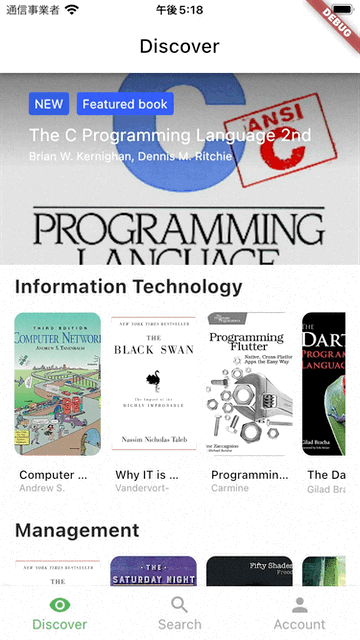
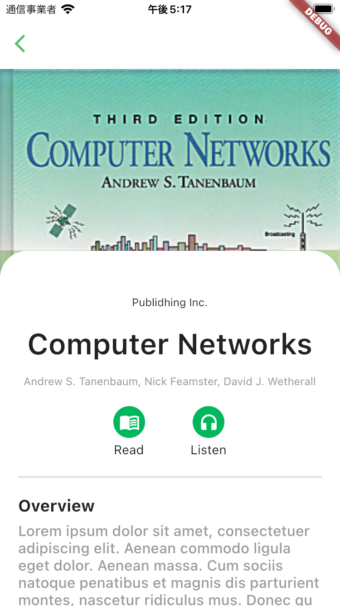
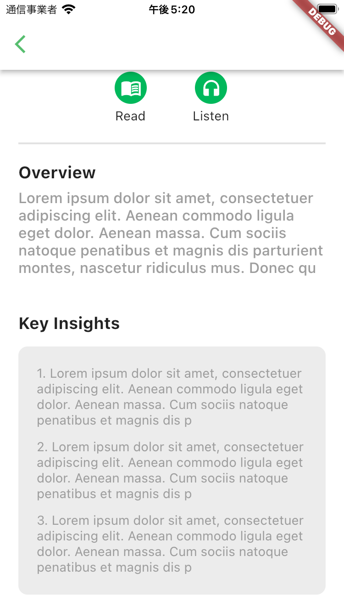

# BookDetailPage 
ここでは、本の詳細を確認できるBookDetailPageを開発します。  
なお、BookDetailPageはDiscoverもしくはSearchから遷移します。  



 
## BookDetailPageの仕様
BookDetailPageはDiscover、もしくはSearchから遷移しますが、その際に表示する本の情報を受け取ります。  

また、AppBarより遷移元のページに戻れます。  
以下はページ上部です。  



`Read`と`Listen`のボタンがありますが、こちらの機能は定義していませんので、クリック時の動作は不要です。  

以下は画面下部です。  




## 開発の準備
前回同様、適切なブランチを作成して開発を進めます。  

```
git checkout -b <ブランチ名>
```

ブランチができたら、今回開発を進めていくディレクトリも作成しておきましょう。  

```
mkdir lib/features/book_detail
```

## タスク1: BookDetailPageの開発
※下記手順は参考。自分が進めやすい順番で自由に進めて構いません。  

1. `lib/features/book_detail/book_detail_page.dart`を作成
1. `book_detail_page.dart`にBookDetailPageの振る舞いを実装


## 完成したら
commitしてpushして、プルリクエストを作成しよう！

```
git add <コミットするファイル>
git commit -m "<変更内容が分かるメッセージ>"
git push origin <ブランチ名>
```

その後、GitHubの当該リポジトリで`main`へのプルリクエストを作成し、Slackでメンターにレビューを依頼してください。  
メンターに`Approve`されたら、`main`にマージしてください！！  
これでSummaristアプリ完成！！ :tada:
時間がある場合は、ボーナスにも挑戦してみよう :D
