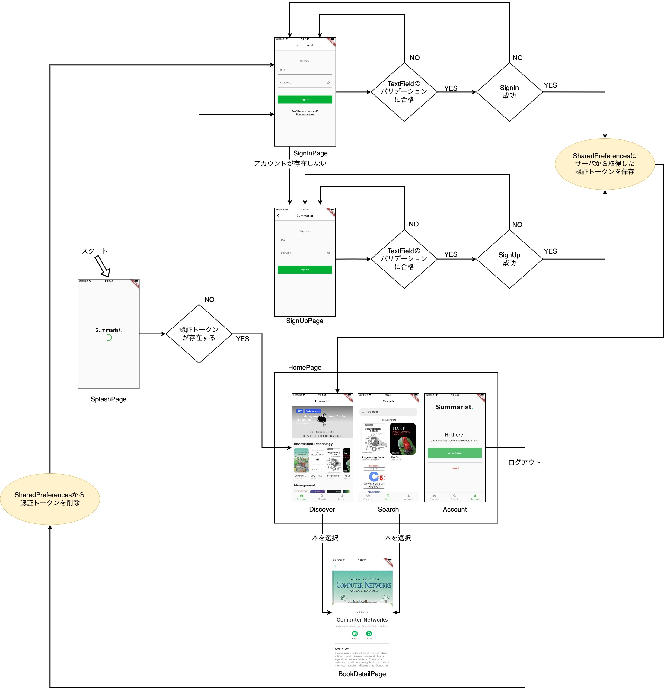

# Summarist

## アプリの全体像
これまで学んできた事を活かしてSummaristアプリをゼロから開発しよう。  

Summaristは、本の要約（サマリー:summary）を閲覧するアプリです。  
全部で7つの画面からなる規模のアプリです。  

下記画像は大きいため、[こちら](./images/summarist_screens.jpg)から画像を取得して適当なビューワーで閲覧してください。



## プロジェクトの構造
今回のアプリはBlocパターン(Cubit)を採用します。  
参考として、以下にプロジェクトの構造を示します。多少変更しても構いません。  

※下記の構造はプロジェクト直下の`lib`ディレクトリ配下のものです。  

```
- features
  |- sign_in
     |- sign_in_page.dart
     |- sign_in_cubit.dart
     |- sign_in_state.dart
     |- sign_in_repository.dart
  |- sign_up
     |- sign_up_page.dart
     |- sign_up_cubit.dart
     |- sign_up_state.dart
     |- sign_up_repository.dart
  |- splash
     |- splash_page.dart
  |- home
     |- home_page.dart
     |- account
        |- account_widget.dart
     |- discover
        |- discover_widget.dart
        |- discover_cubit.dart
        |- discover_state.dart
        |- discover_repository.dart
     |- search
        |- search_widget.dart
        |- search_cubit.dart
        |- search_state.dart
        |- search_repository.dart
- models
  |- book.dart
  |- category.dart
  |- ... any other models which you need
- widgets
  |- ... all additional widgets
```

上記サンプルのファイル名にはいくつか接尾辞が付いています。それらは以下のような意味です。  

| 接尾辞 | 意味 |
| ---- | ---- |
| _page | レイアウトを構築するWidgetを含むファイル。1つのページを著す。各ページでは、必要に応じてCubitを提供するためにBlocProviderを使います。 |
| _cubit | ビジネスロジックを担うコンポーネント。Cubitを実装していて、Viewの状態を持つ。 |
| _state | Cubitが取り得るstateを含む。 |
| _repository | APIの呼びだし等、データへのアクセスを提供する。 |


## 開発の進め方
以下の順番に従って開発しよう！  

1. [プロジェクトの初期化と開発環境の構築](./1_setup/README.md)
2. [HomePageの雛形とAccountWidget](./2_homepage/README.md)
3. [SignInPageとSignOutPage](./3_signin_signup/README.md)
4. [SplashPage](./4_splash/README.md)
5. [DiscoverWidget(HomePage)](./5_discover/README.md)
6. [:tada: BONUS :tada:](./6_bonus/README.md)
7. [:tada: BONUS :tada:](./7_bonus/README.md)
8. [:tada: BONUS :tada:](./8_bonus/README.md)
