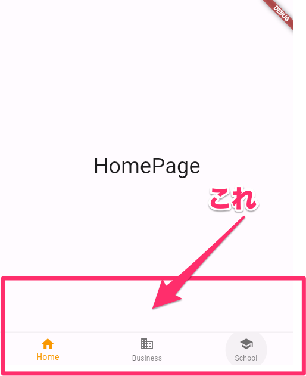

## BottomNavigationBar
画面の下部に配置し、押されたボタンによって表示するページを切り替えるWidgetです。  




### BottomNavigationBarを使う準備
1. BottomNavigationBarを配置するページはStatefulWidgetとする。
1. 表示するページ一覧をリストで保持する。
1. 現在どのページを表示しているか保存する変数を用意する。（int型の変数とし、「2」で用意したリストの何番目のページを表示しているかの情報を保存する。）  


```dart
import 'package:flutter/material.dart';

// 1. BottomNavigationBarを配置するページはStatefulWidgetとする。
class BottomNavigationBarExample extends StatefulWidget {
  const BottomNavigationBarExample({super.key});

  @override
  State<BottomNavigationBarExample> createState() =>
      _BottomNavigationBarExampleState();
}

class _BottomNavigationBarExampleState
    extends State<BottomNavigationBarExample> {
  // 2. 表示するページ一覧をリストで保持する。
  static const _pages = [
    HomePage(),
    BusinessPage(),
    SchoolPage(),
  ];

  // 3. 現在どのページを表示しているか保存する変数を用意する。（int型の変数とし、「2」で用意したリストの何番目のページを表示しているかの情報を保存する。） 
  int _selectedIndex = 0;

  // (省略)

```

### ScaffoldにBottomNavigationBar指定

```dart
Scaffold(
  body: _pages[_selectedIndex], // ページ一覧(_page)からページを選択して表示
  // BottomNavigationBarを作成
  bottomNavigationBar: BottomNavigationBar(
    selectedItemColor: Colors.orange,
    currentIndex: _selectedIndex, // 現在選択されている番号
    // BottomNavigationBarItemのいずれかがタップされたときに実行する処理。
    // (index) {} の`index`はタップされたBottomNavigationBarItemのindex番号(何番目のボタンがタップされたか)
    onTap: (index) {
      setState(() {
        _selectedIndex = index;
      });
    },
    // BottomNavigationBarに表示されるボタン（アイコン）の一覧
    items: const [
      BottomNavigationBarItem(
        icon: Icon(Icons.home),
        label: 'Home',
      ),
      BottomNavigationBarItem(
        icon: Icon(Icons.business),
        label: 'Business',
      ),
      BottomNavigationBarItem(
        icon: Icon(Icons.school),
        label: 'School',
      ),
    ],
  ),
);
```