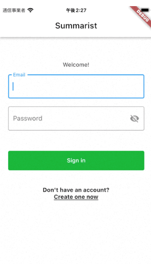
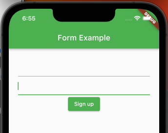
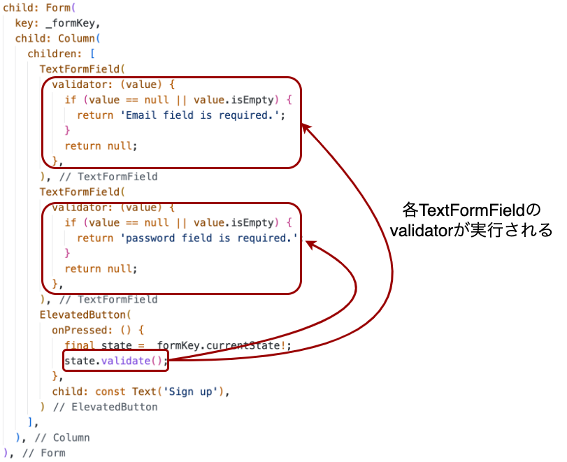
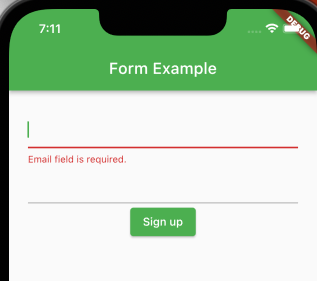
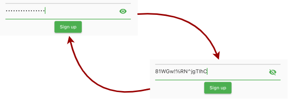

## Formの使い方を確認
今回はSignInPageおよびSignUpPageの2つを作ります。  
それぞれの画面にはEmailとパスワードを入力できるフォームがあります。  



このようなフォームは`TextField`を複数使って作成できます。  
しかし、`Form`ウィジェットを使えば複数のTextFieldを束ねて管理できます。  

:pencil2: Formウィジェットを使う際はTextFieldの代わりにTextFormFieldを使います。  

Formウィジェットの使い方は以下の公式ドキュメントで解説されています。  
https://docs.flutter.dev/cookbook/forms/validation

ここでは、少し詳細に解説します。  

### Formの作成
今回の入力フォームを見ると以下の3つの要素があります。  

- Emailの入力フォーム
- Passwordの入力フォーム
- Sign inボタン（送信ボタン）

まずは見た目から作っていきましょう。  
Formウィジェットを使うと次のように表せます。  

```dart
Form(
  key: _formKey,
  child: Column(
    children: [
      TextFormField(),
      TextFormField(),
      ElevatedButton(
        onPressed: () { },
        child: const Text('Sign up'),
      )
    ],
  ),
),
```

:warning: ここでは枠線などの装飾は解説しません。  

以下のように3つの要素ができます。　　



## バリデーションの追加
バリデーションとは、データが正しいのか確かめることです。  
ここでは、ユーザの入力内容に問題がないか確かめることを言います。  
例えば、入力必須にもかかわらず、何も入力していない場合「これは必須項目です」など表示する必要があります。  


`TextFormField`の`validator`プロパティには、そこに入力された値が正しいかどうかチェックする関数を登録できます。  

この関数の仕様は以下の通りです。

- TextFormFieldに入力された値が渡ってくる
- ユーザの入力に問題がある: 表示するエラーメッセージを返す（String）
- 問題無し: nullを返す。

以下は、EmailのTextFormFieldのバリデーションです。  

```dart
TextFormField(
  // validatorには、ユーザに表示するエラーメッセージを返す
  validator: (value) { // value: TextFormFieldに入力された値
    if (value == null || value.isEmpty) {
      return 'Email field is required.'; // 表示するエラーメッセージ
    }
    
    // ユーザの入力に問題がない場合はnullを返す
    return null;
  },
),
```

`validator`に登録した関数はTextFormFieldだけでは実行されません。  
Formウィジェットに対してvalidation命令を出した時に実行されます。  

では、それをやってみましょう。  
そのためには、Formウィジェットのstateにアクセスする必要があります。  
そのために、以下のようにGlobalKeyと呼ばれるkeyを用意します。  
用意したkeyは、Formウィジェットの`key`プロパティに設定します。  

```dart
  class _SignUpPageState extends State<SignUpPage> {
  final _formKey = GlobalKey<FormState>(); // Keyを用意

  @override
  Widget build(BuildContext context) {
    return Scaffold(
      appBar: AppBar(
        title: const Text('Form Example'),
      ),
      body: Center(
        child: Padding(
          padding: const EdgeInsets.all(24.0),
          child: Form(
            key: _formKey,  // <------- 作成した_formKeyを設定
            child: Column(
              children: [
                TextFormField(),
                TextFormField(),
                ElevatedButton(
                  onPressed: () {},
                  child: const Text('Sign up'),
                )
              ],
              // 以下省略
```

以降はこのGlobalKeyである`_formKey`を使ってFormにアクセスできます。  

では、Sign upボタンが押されたとき、validation命令をだしましょう。  
`ElevatedButton`の`onPressed`プロパティに設定しましょう。  

```dart
ElevatedButton(
  onPressed: () {
    final state = _formKey.currentState!; // keyからstateを取得
    state.validate(); // Form内のTextFormFieldにvalidation命令を出す
  },
  child: const Text('Sign up'),
)
```

:bulb: `_formKey.currentState!`と`!`を使っていますが、ここでは問題ありません。`currentState`の[仕様上](https://api.flutter.dev/flutter/widgets/GlobalKey/currentState.html)、このタイミングで`currentState`がnullにならないことが保証されているからです。  




では、実際にEmailを未入力にしてSign inボタンを押下してみます。  



以下のようにvalidatorが返したエラーメッセージが表示されます。  


<details>
<summary>ここまでの全コードをみるにはここをクリック</summary>

```dart
import 'package:flutter/material.dart';

class SignUpPage extends StatefulWidget {
  const SignUpPage({super.key});

  @override
  State<SignUpPage> createState() => _SignUpPageState();
}

class _SignUpPageState extends State<SignUpPage> {
  final _formKey = GlobalKey<FormState>();

  @override
  Widget build(BuildContext context) {
    return Scaffold(
      appBar: AppBar(
        title: const Text('Form Example'),
      ),
      body: Center(
        child: Padding(
          padding: const EdgeInsets.all(24.0),
          child: Form(
            key: _formKey,
            child: Column(
              children: [
                TextFormField(
                  validator: (value) {
                    if (value == null || value.isEmpty) {
                      return 'Email field is required.';
                    }
                    return null;
                  },
                ),
                TextFormField(
                  validator: (value) {
                    if (value == null || value.isEmpty) {
                      return 'password field is required.';
                    }
                    return null;
                  },
                ),
                ElevatedButton(
                  onPressed: () {
                    final state = _formKey.currentState!;
                    state.validate();
                  },
                  child: const Text('Sign up'),
                )
              ],
            ),
          ),
        ),
      ),
    );
  }
}
```

</details>


## バリデーションに合格（パス）したとき
FormStateの`validation()`メソッドを実行すると、各TextFormFieldのvalidatorが実行されることを確認しました。  

ここで、FormStateの`validation()`メソッドは、boolを返すメソッドです。  

- Form内の全てのvalidatorがnullを返したとき`true`を返す。
  - すなわち、Form内にバリデーションエラーがない場合`true`を返す。
- 上記以外の場合`false`を返す。

そこで、以下のようにすることでForm内全てのバリデーションエラーが解消されたとき、任意の処理を実行できます。  

```dart
final state = _formKey.currentState!;
if (state.validate()) {
  // Form内の全てのバリデーションに合格
}
```

## TextFormFieldのonSavedプロパティ
TextFormFieldには`onSaved`というプロパティが存在します。  
このプロパティには関数を登録でき、Formウィジェットに対してsave命令を出した時に実行されます。  
通常、`onSaved`ではFormに入力された値をStatefulWidgetの変数に格納する、などの処理を行います。  

ここでは、StatefulWidgetに`_email`と`_password`というプロパティを定義し、`onSaved`で保存しましょう。  

```dart
class _SignUpPageState extends State<SignUpPage> {
  final _formKey = GlobalKey<FormState>();
  String _email = '';    // <---- プロパティ追加
  String _password = ''; // <---- プロパティ追加

  @override
  Widget build(BuildContext context) {
    return Scaffold(
      appBar: AppBar(
        title: const Text('Form Example'),
      ),
      body: Center(
        child: Padding(
          padding: const EdgeInsets.all(24.0),
          child: Form(
            key: _formKey,
            child: Column(
              children: [
                TextFormField(
                  validator: (value) {
                    if (value == null || value.isEmpty) {
                      return 'Email field is required.';
                    }
                    return null;
                  },
                  // onSavedが実行されたとき、プロパティに値を格納
                  onSaved: (newValue) { //newValueはTextFormFieldに入力された値
                    if (newValue != null && newValue.isNotEmpty) {
                      _email = newValue;
                    }
                  },
                ),
                TextFormField(
                  validator: (value) {
                    if (value == null || value.isEmpty) {
                      return 'password field is required.';
                    }
                    return null;
                  },
                  // onSavedが実行されたとき、プロパティに値を格納
                  onSaved: (newValue) { //newValueはTextFormFieldに入力された値
                    if (newValue != null && newValue.isNotEmpty) {
                      _password = newValue;
                    }
                  },
                ),
  // 省略
```

それでは、Formからsave命令を出してみます。  

```dart
ElevatedButton(
  onPressed: () {
    final state = _formKey.currentState!;
    if (state.validate()) {
      state.save();  // <------ 各TextFormFieldのonSavedが実行される
      // ここにFormを送信する処理などを書く
    }
  },
  child: const Text('Sign up'),
)
```

<details>
<summary>ここまでの全コードをみるにはここをクリック</summary>

```dart
import 'package:flutter/material.dart';

class SignUpPage extends StatefulWidget {
  const SignUpPage({super.key});

  @override
  State<SignUpPage> createState() => _SignUpPageState();
}

class _SignUpPageState extends State<SignUpPage> {
  final _formKey = GlobalKey<FormState>();
  String _email = '';
  String _password = '';

  @override
  Widget build(BuildContext context) {
    return Scaffold(
      appBar: AppBar(
        title: const Text('Form Example'),
      ),
      body: Center(
        child: Padding(
          padding: const EdgeInsets.all(24.0),
          child: Form(
            key: _formKey,
            child: Column(
              children: [
                TextFormField(
                  validator: (value) {
                    if (value == null || value.isEmpty) {
                      return 'Email field is required.';
                    }
                    return null;
                  },
                  onSaved: (newValue) {
                    if (newValue != null && newValue.isNotEmpty) {
                      _email = newValue;
                    }
                  },
                ),
                TextFormField(
                  validator: (value) {
                    if (value == null || value.isEmpty) {
                      return 'password field is required.';
                    }
                    return null;
                  },
                  onSaved: (newValue) {
                    if (newValue != null && newValue.isNotEmpty) {
                      _password = newValue;
                    }
                  },
                ),
                ElevatedButton(
                  onPressed: () {
                    final state = _formKey.currentState!;
                    if (state.validate()) {
                      state.save();
                    }
                  },
                  child: const Text('Sign up'),
                )
              ],
            ),
          ),
        ),
      ),
    );
  }
}

```

</details>


## パスワードを隠す
TextFormFieldには、パスワードのような機密性の高い情報用のものもあります。  
その場合、入力した内容は「●」のように見えなくします。（画面越しに他者に見られるのを避けるため。[ショルダーハック](https://atmarkit.itmedia.co.jp/ait/articles/0401/01/news027.html)などと言います。）  

ただし、ユーザによってはショルダーハックのリスクが低い場合には入力内容を見ながら入力したい場合もあります。  
今回のアプリではユーザが自由に切り替えられるようにしましょう。  



そのためには、TextFormFieldの`obscureText`プロパティを使います。  
このプロパティが`true`のときは入力内容が「●」で表示され、見えなくなります。  

```dart
TextFormField(
  obscureText: true, // 入力内容が「●」で表示される。
  // 省略
),
```

今回はTextFormFieldの中に表示された目のアイコンをクリックすることで切り替えれるようにしましょう。  
まずは、この状態を管理するために`_isPasswordVisible`プロパティを追加しておきます。  

```dart
class _SignUpPageState extends State<SignUpPage> {
  final _formKey = GlobalKey<FormState>();
  bool _isPasswordVisible = false; // <--- パスワードの表示状態を保持

  @override
  Widget build(BuildContext context) {
                // 省略
                TextFormField(
                  obscureText: !_isPasswordVisible, // <--- 入力内容の表示設定
                // 省略
```

続いて、TextFormFieldの中にIconButtonを表示して`_isPasswordVisible`を切り替えます。  

```dart
TextFormField(
  // 省略
  obscureText: !_isPasswordVisible,
  decoration: InputDecoration(
    suffixIcon: IconButton(
      // IconButtonクリック時にパスワードの表示設定を切り替え
      onPressed: () {
        setState(() {
          _isPasswordVisible = !_isPasswordVisible;
        });
      },
      // パスワードの表示設定に応じて表示する目のアイコンを切り替え
      icon: _isPasswordVisible
          ? const Icon(Icons.visibility_off)
          : const Icon(Icons.visibility),
    ),
  ),
),
```

以上でパスワードの表示設定を切り替える事ができます。  

<details>
<summary>ここまでの全コードをみるにはここをクリック</summary>

```dart
import 'package:flutter/material.dart';

class SignUpPage extends StatefulWidget {
  const SignUpPage({super.key});

  @override
  State<SignUpPage> createState() => _SignUpPageState();
}

class _SignUpPageState extends State<SignUpPage> {
  final _formKey = GlobalKey<FormState>();
  bool _isPasswordVisible = false;
  String _email = '';
  String _password = '';

  @override
  Widget build(BuildContext context) {
    return Scaffold(
      appBar: AppBar(
        title: const Text('Form Example'),
      ),
      body: Center(
        child: Padding(
          padding: const EdgeInsets.all(24.0),
          child: Form(
            key: _formKey,
            child: Column(
              children: [
                TextFormField(
                  validator: (value) {
                    if (value == null || value.isEmpty) {
                      return 'Email field is required.';
                    }
                    return null;
                  },
                  onSaved: (newValue) {
                    if (newValue != null && newValue.isNotEmpty) {
                      _email = newValue;
                    }
                  },
                ),
                TextFormField(
                  validator: (value) {
                    if (value == null || value.isEmpty) {
                      return 'password field is required.';
                    }
                    return null;
                  },
                  onSaved: (newValue) {
                    if (newValue != null && newValue.isNotEmpty) {
                      _password = newValue;
                    }
                  },
                  obscureText: !_isPasswordVisible,
                  decoration: InputDecoration(
                    suffixIcon: IconButton(
                      onPressed: () {
                        setState(() {
                          _isPasswordVisible = !_isPasswordVisible;
                        });
                      },
                      icon: _isPasswordVisible
                          ? const Icon(Icons.visibility_off)
                          : const Icon(Icons.visibility),
                    ),
                  ),
                ),
                ElevatedButton(
                  onPressed: () {
                    final state = _formKey.currentState!;
                    if (state.validate()) {
                      state.save();
                    }
                  },
                  child: const Text('Sign up'),
                )
              ],
            ),
          ),
        ),
      ),
    );
  }
}
```

</details>


ここまでできたら必要なロジックは完成です。  
あとTextFormFieldの装飾（枠線など）を実装イメージに似せてください。  
なお、SignUpPageとSignInPageのFormはほぼ同じです。余力があればこのForm部分をクラスとして切り出してみよう。  