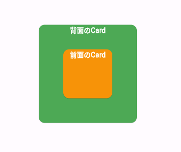

## スクロール
### ListView
リストを作成するにはListViewを使います。  
ListViewは通常は縦スクロールですが、`scrollDirection`プロパティを設定することで、横スクロールにできます。　　


```dart
return Scaffold(
  appBar: AppBar(title: const Text('ListView Example')),
  // SizedBoxで全体の高さを設定する
  body: SizedBox(
    height: 100,
    child: ListView.builder(
      scrollDirection: Axis.horizontal, // 横スクロール
      itemCount: 10,
      itemBuilder: (context, index) => Card(
        color: index.isEven ? Colors.orange : Colors.green,
        child: Center(
          child: SizedBox(
            height: 100,
            width: 100,
            child: Center(
              child: Text('$index'),
            ),
          ),
        ),
      ),
    ),
  ),
);
```

### SingleChildScrollView
また、`SingleChildScrollView`を使うと、ListViewを使わなくても縦方向のスクロールができます。  


```dart
Scaffold(
  appBar: AppBar(
    title: const Text('SingleChildScrollView Example'),
  ),
  body: const SingleChildScrollView(
    child: Center(
      child: Column(
        children: [
          Card(
            color: Colors.green,
            child: SizedBox(
              width: 200,
              height: 200,
              child: Center(child: Text('1')),
            ),
          ),
          Card(
            color: Colors.orange,
            child: SizedBox(
              width: 200,
              height: 200,
              child: Center(child: Text('2')),
            ),
          ),
          // (省略)
        ],
      ),
    ),
  ),
);
```


### SingleChildScrollViewとListViewを組み合わせる
SingleChildScrollViewとListView(横スクロール)を組み合わせることができます。  


```dart
 Scaffold(
  appBar: AppBar(
    title: const Text('SingleChildScrollViewとListView'),
  ),
  body: SingleChildScrollView(
    child: Column(
      children: [
        const Text('リスト1'),
        SizedBox(
          height: 200,
          child: ListView.builder(
            scrollDirection: Axis.horizontal,
            itemCount: 5,
            itemBuilder: (context, index) => Card(
              color: index.isEven ? Colors.green : Colors.orange,
              child: SizedBox(
                height: 200,
                width: 200,
                child: Center(child: Text('$index')),
              ),
            ),
          ),
        ),
        // ... (省略)
      ],
    ),
  ),
);
```

## 要素を重ねる: Stack
`Stack`を使うとWidgetを重ねることができます。  




`Stack`は`children`プロパティに複数のWidgetを指定できます。  
childrenに指定したWidgetのうち、後に来たものほど上に重ねられます。  
図では、childrenは以下のようになっています。

- 0番目: 背面のCard
- 1番目: 前面のCard

前面のCardがより後ろにあるため、「背面のカード」に「前面のCard」が重ねて表示されます。  


```dart
Scaffold(
  appBar: AppBar(title: const Text('Stack Example')),
  body: const Center(
    child: Stack(
      alignment: Alignment.center, // どのように重ねるか
      children: [
        Card(
          color: Colors.green,
          child: SizedBox(
            height: 200,
            width: 200,
            child: Text(
              '背面のCard',
               // 省略
              ),
            ),
          ),
        ),
        Card(
          color: Colors.orange,
          child: SizedBox(
            height: 100,
            width: 100,
            child: Text(
              '前面のCard',
               // 省略
              ),
            ),
          ),
        )
      ],
    ),
  ),
);
```